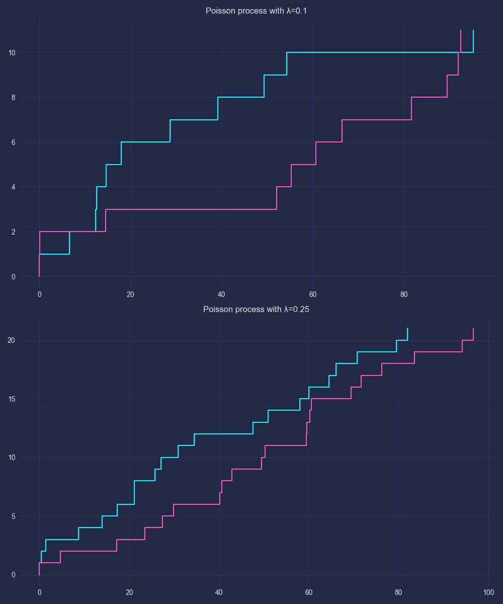

# Process_of_Puasson-s

  

<h1>Процес Пуассона</h1>

Код створює об'єктно-орієнтовану реалізацію процесу Пуассона в Python і 
використовує matplotlib для візуалізації отриманих траєкторій.

<h2>Імпорт необхідних бібліотек:</h2>

Numpy використовується для генерації випадкових чисел із відповідних розподілів.
matplotlib.pyplot використовується для створення графіків. mplcyberpunk використовується для застосування кіберпанкового стилю до графіків.

<h2>Клас PoissonProcess</h2>

Клас PoissonProcess створюється з двома методами:

Конструктор __init__ приймає інтенсивність intensity та граничний час T для процесу Пуассона.
Метод generate_trajectory генерує траєкторію процесу Пуассона відповідно до вказаної інтенсивності і граничного часу.
Функція plot_trajectories приймає список траєкторій процесів Пуассона і список відповідних міток і візуалізує кожну траєкторію на окремому підграфіку.

В блоку if __name__ == "__main__":

Визначаються значення інтенсивності (lambdas) і граничний час (T).
За кожним значенням інтенсивності створюється об'єкт PoissonProcess і генеруються дві траєкторії, які зберігаються в списку trajectories.
Створюється список міток labels для кожного процесу Пуассона.
Викликається функція plot_trajectories для візуалізації траєкторій.

